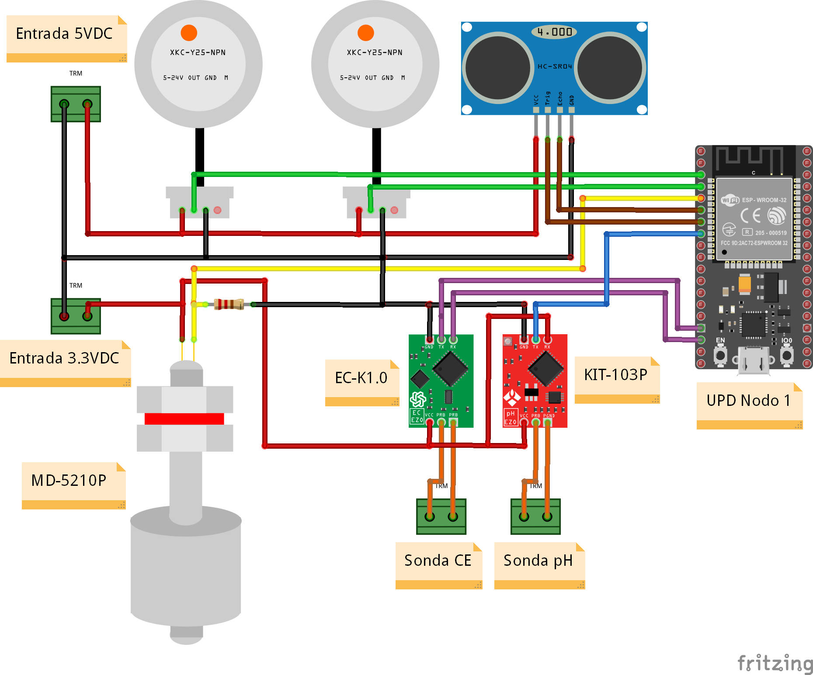
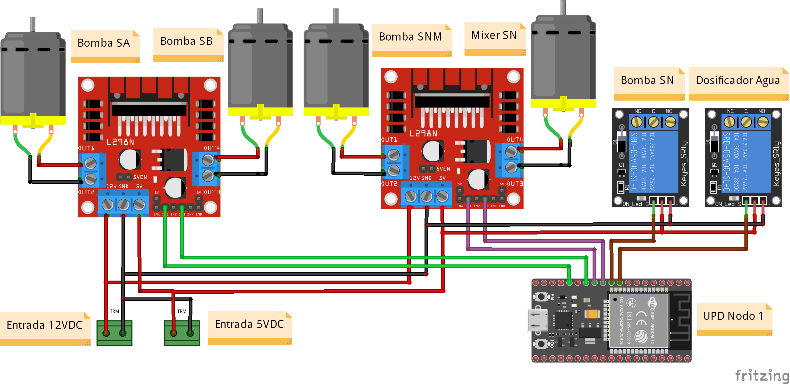
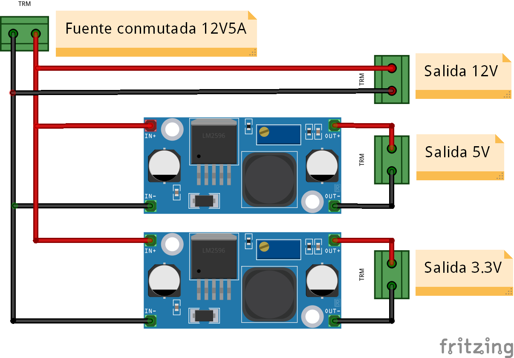
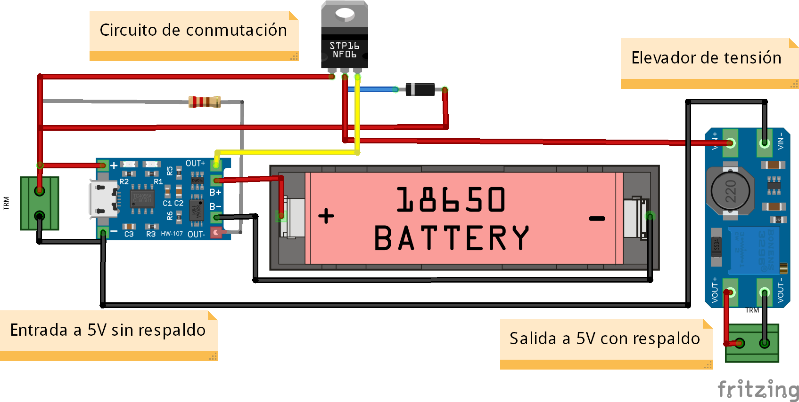
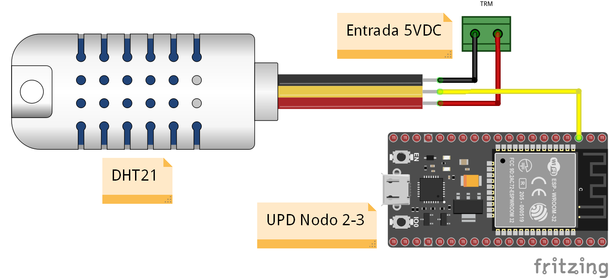
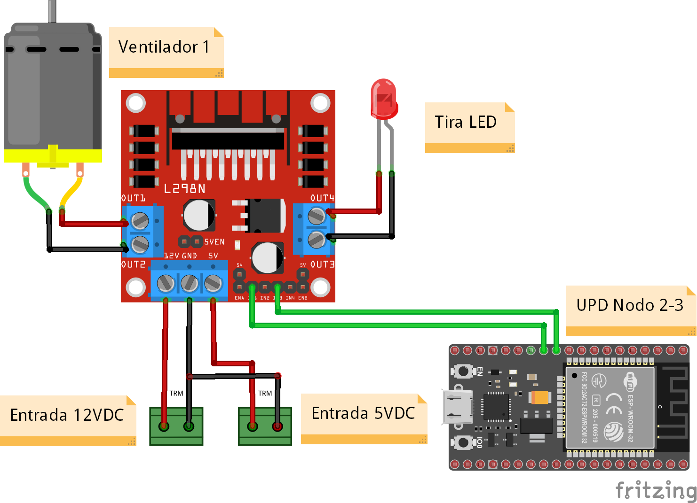

# MechaponicsNode (rama nodeSN/main)

Firmware para ESP32 que controla el nodo de solucion nutritiva de un sistema hidroponico automatizado Mechaponics. Gestiona la preparacion de solucion nutritiva mediante control difuso, monitoreo de sensores, riego automatizado y comunicacion con Firebase para integracion con la aplicacion movil.

## Tecnologias

- **Plataforma:** Espressif32 (ESP32 DoIt DevKit v1)
- **Framework:** Arduino
- **IDE:** PlatformIO
- **Conectividad:** WiFi + Firebase Realtime Database
- **Almacenamiento:** SD Card (datalog y perfiles) + SPIFFS (credenciales WiFi)

## Dependencias principales

| Libreria | Uso |
|---|---|
| Firebase ESP32 Client 4.3.5 | Comunicacion con Firebase Realtime Database |
| AsyncWebServer + AsyncTCP | Servidor web para configuracion WiFi |
| DallasTemperature + OneWire | Sensor de temperatura DS18B20 |
| ph_grav | Sensor de pH por gravedad |
| Adafruit SSD1306 + GFX | Pantalla OLED 128x32 |
| ArduinoJson | Serializacion de datos para datalog y UART |
| TaskScheduler | Programacion de tareas periodicas |

## Sensores

| Sensor | Interfaz | Funcion |
|---|---|---|
| pH | Analogico (GPIO 33) | Acidez/alcalinidad de la solucion |
| Conductividad Electrica (CE) | Serial 9600 baud | Concentracion de nutrientes (uS/cm) |
| Temperatura (DS18B20) | OneWire (GPIO 15) | Temperatura de la solucion |
| Nivel SN | Ultrasonico (GPIO 32/35) | Nivel del tanque principal (%) |
| Nivel SA, SB, SNM | Digital (GPIO 36, 39, 34) | Presencia en tanques buffer |

## Actuadores

| Actuador | Tipo | Funcion |
|---|---|---|
| Bomba de llenado | PWM (GPIO 26) | Llenado del tanque principal |
| Bomba SA | PWM (GPIO 13) | Dosificacion de acido |
| Bomba SB | PWM (GPIO 12) | Dosificacion de base |
| Bomba SNM | PWM (GPIO 27) | Dosificacion de nutrientes |
| Motores mezcladores | PWM (GPIO 14, 25) | Mezcla de solucion |
| Bomba sumergible | PWM (GPIO 0) | Riego por ciclos de 30s cada 3 min |

### Diagramas de conexiones - Nodo de Solucion Nutritiva (N1)

<p align="center">
  
  <br/>
  <i>Conexiones de sensores: pH, CE, temperatura (DS18B20) y niveles de tanques</i>
</p>

<p align="center">
  
  <br/>
  <i>Conexiones de actuadores: bombas dosificadoras (SA, SB, SNM), mezcladores y bomba sumergible</i>
</p>

<p align="center">
  
  <br/>
  <i>Esquema de conexiones completo de alimentación del modulo ESP32</i>
</p>

<p align="center">
  
  <br/>
  <i>Esquematico del sistema de alimentacion UPS</i>
</p>

## Modos de operacion

- **Automatico:** Carga perfil desde SD, prepara solucion nutritiva con control difuso (25 reglas, tolerancia pH +/-0.2, CE +/-30 uS/cm), ejecuta riego programado y registra datos
- **Demostrativo:** Prueba individual de subsistemas (dosificadores, mediciones, solucion, riego) controlado desde Firebase/App

## Control difuso

El sistema utiliza un controlador de logica difusa con 2 entradas (error de pH y error de CE) y 3 salidas (tiempo de activacion de bombas SA, SB, SNM). Las funciones de membresia son trapezoidales y triangulares con 25 reglas de inferencia para dosificacion proporcional.

## Tareas programadas

| Tarea | Intervalo | Funcion |
|---|---|---|
| Estado Firebase | 1 hora | Lectura de modo de operacion |
| Perfil Firebase | 1 hora | Lectura de valores objetivo |
| Escritura Firebase | 20 min | Subida de lecturas de sensores |
| Datalog SD | 20 min | Registro local en tarjeta SD |
| Riego | 3 min | Activacion de bomba sumergible |
| Display OLED | 2 min | Rotacion de parametros en pantalla |

## Estructura del firmware

```
src/
├── main.cpp                          # Punto de entrada y loop principal
├── MechaponicsSConfig.hpp            # Pinout y variables globales
├── MechaponicsSInit.hpp              # Inicializacion del sistema
├── MechaponicsSFirebase.hpp          # Comunicacion con Firebase
├── MechaponicsSTask.hpp              # Configuracion del scheduler
├── MechaponicsSPrepareSN.hpp         # Orquestador de preparacion de solution
├── MechaponicsSWiFiManager.hpp       # Gestion WiFi y AP de configuracion
├── MechaponicsSOLED.hpp              # Driver de pantalla OLED
├── MechaponicsSModeDemonstrative.hpp # Modo demostrativo
├── MechaponicsSUART.hpp              # Comunicacion multi-nodo
├── MechaponicsSTime.hpp              # Utilidades de tiempo
└── prepareSN/
    ├── PrepareSNFuzzyControl.hpp     # Motor de inferencia difusa
    ├── PrepareSNSensorPH.hpp         # Lectura y calibracion de pH
    ├── PrepareSNSensorCE.hpp         # Lectura de conductividad
    ├── PrepareSNSensorTemperature.hpp# Lectura de temperatura
    ├── PrepareSNSensorLevelTank.hpp  # Medicion ultrasonica de nivel
    ├── PrepareSNSensorsBuffer.hpp    # Sensores de presencia de tanques
    ├── PrepareSNFillTankSN.hpp       # Logica de llenado
    ├── PrepareSNDosePump.hpp         # Control de bombas dosificadoras
    ├── PrepareSNMixerTank.hpp        # Control de motores mezcladores
    ├── PrepareSNIrrigateSN.hpp       # Control de riego
    ├── PrepareSNLoadProfile.hpp      # Lectura/escritura en SD
    └── PrepareSNSaveDatalog.hpp      # Registro de datos en SD
```

## Configuracion WiFi

El nodo expone un Access Point (`MECHA_ESP_SN`, password: `123456789`) con una interfaz web en `192.168.4.1` para configurar las credenciales de la red WiFi. Las credenciales se almacenan en SPIFFS y persisten entre reinicios.

## Ramas del repositorio

- **nodeSN/main:** Nodo de solucion nutritiva (este README)
- **nodeCrop/main:** Nodo de celda de cultivo (variante con sensores de ambiente: DHT21, tira LED, ventilador)

Ambas ramas comparten la base de inicializacion, WiFi, Firebase y tareas programadas, pero difieren en los modulos de sensores/actuadores especificos.

### Diagramas de conexiones - Nodo de Cultivo (N2-N4)

<p align="center">
  
  <br/>
  <i>Conexiones de sensores del nodo de cultivo: DHT21 (temperatura/humedad)</i>
</p>

<p align="center">
  
  <br/>
  <i>Conexiones de actuadores del nodo de cultivo: tira LED y ventilador</i>
</p>

## Relacion con MechaponicsApp

Este firmware es el componente de hardware del sistema Mechaponics. La aplicacion movil Android ([MechaponicsApp](../MechaponicsApp)) sirve como interfaz de usuario. La comunicacion es **indirecta a traves de Firebase Realtime Database**:

- **Nodo -> Firebase -> App:** Lecturas de sensores (pH, CE, temperatura, niveles)
- **App -> Firebase -> Nodo:** Parametros objetivo (pH, CE), modo de operacion y flags de demostracion
